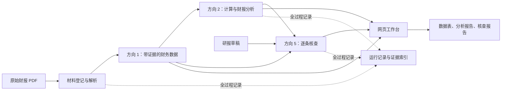

# 项目计划：财报分析与研报核查工作台

日期：2026-09-26。参赛方向已由团队确定为 1（数据结构化提取）、2（上市公司财务报告分析）、5（研究报告纠错核查）。本文件是实施规划；模块与指标目标均不代表已经实现。

主模型暂定 DeepSeek，具体调用流程、模型与程序职责以及首个真实样例见 [DeepSeek 嵌入方案](DeepSeek嵌入方案.md)。

## 1. 产品目标与三个方向的关系

用户导入原始财报，获得带出处的财务数据和分析；再导入研报草稿，获得逐条核查结果、证据和修改建议。

三个方向共用数据和证据：方向 1 负责读准材料，方向 2 负责计算和有依据的分析，方向 5 负责检查草稿是否正确使用这些事实。最终呈现为一个工作台。

方向 1 的首期范围选为财报中的复杂表头、跨行指标、单位与附注抽取，服务方向 2、5。此前讨论过的股权质押事件系统不纳入本轮范围。比赛允许选择一个或多个方向，公开通知没有要求每个所选方向各建一个产品。

## 2. 核心功能与产出

| 模块 | 需要完成的工作 | 可查看的产出 |
| --- | --- | --- |
| 材料管理 | 导入文件，登记公司、报告期、发布日期、来源和文件指纹；保存原件；选择本次任务使用的材料 | 材料清单、阅读入口、任务材料范围 |
| 财报抽取（方向 1） | 找到相关表格和说明，识别行列含义、单位、年份、调整前后版本，形成可核对的字段 | 统一数据表；每条记录附原文和位置 |
| 财报分析（方向 2） | 对可比数据执行计算，识别客观变化；检索公司披露的变化原因与相关附注 | 指标变化表、趋势图、原因摘述及异常提示 |
| 研报核查（方向 5） | 提取草稿中的数字和可核验表述，匹配事实或计算，识别冲突并提出具体修改 | 原句、判定、依据、计算、修改建议 |
| 智能体任务流程 | 大模型理解材料和草稿，提出取证与计算请求；程序验证请求、执行工具、记录结果；缺证时有限次补查 | 可查看的任务步骤和工具结果 |
| 网页与导出 | 展示材料、数据、分析和核查；点击结果定位原文；导出可分享结果 | 本地网页、CSV、HTML 报告，后期补 PDF 导出 |
| 质量与复现 | 建人工答案、分阶段评价、记录完整运行过程，整理依赖与运行说明 | 评测报告、运行记录、可复现样例 |

这些模块按代码职责拆分，在初赛版本中放在一个 Python 项目中运行。

## 3. 初赛前的功能范围

### 3.1 输入与数据范围

- 支持可提取文本的中文上市公司年度报告 PDF；研发从现有 3 家消费行业公司开始。
- 每次分析先聚焦一家公司的跨年材料；每个任务明确其材料范围和使用的版本。
- 草稿先支持粘贴文本和上传 TXT；保留段落、句子位置，确保核查结果能回到草稿原句。
- 第一批指标固定为营业收入、归母净利润、扣非归母净利润、经营现金流净额；读取当期及可比上期数据。
- 优先提高不同公司、不同表头上的正确性。毛利率所需的营业成本、半年报/季报、扫描件 OCR、DOCX/PDF 草稿导入放到扩展阶段。
- 模型可调用范围限定为本次导入的材料与允许的计算工具。调用模型接口时记录实际传出的证据片段，现场联网条件需按后续赛事通知落实。

### 3.2 方向 1：数字必须带完整身份

每条财务事实至少保存：公司、指标、期间、统计口径、原始数值、原始单位、标准化数值、调整前后状态、来源文档、PDF 页序、原文片段、表头/单位依据和页面坐标。材料没有明确给出的属性保留为未知，不能默认为正确。

同一年度的数字可能出现在不同年度报告中。不同版本分别保存；计算时记录选用的比较版本，不静默覆盖旧值。PDF 页序和文档印刷页码分开，避免定位偏移。

通用的抽取过程：候选页定位 → 表格和说明解析 → 模型识别字段含义 → 程序检查格式、单位和列关系 → 对缺项或冲突回看证据 → 保存可追踪记录。对无法可靠解析的材料明确给出失败或待复核状态。

### 3.3 方向 2：分析包含计算、披露原因和信号

首期分析输出三类内容：

1. **确定的计算事实**：四项指标的跨年数值、变动额；可比且上期基数为正时计算普通同比。保留公式、操作数和各自来源。
2. **公司披露的变化原因**：定位年报中对应指标的解释，摘述并标记为“公司披露”；检查是否对应同一公司、期间和指标。找到一段说明不能等同于证明全部变化原因。
3. **需要关注的信号**：如利润和经营现金流变化方向不同、归母与扣非利润差额明显变化、比较数据存在调整。先展示事实与依据，再提示需要复核的内容。

上期为零或负数、期间长度不同、口径未知等情况下，普通同比不直接套用；给出变动额或原文披露值及适用说明。没有依据时不给出经营变化的确定原因。异常信号不直接推出造假、偿债危机等结论。

### 3.4 方向 5：草稿核查范围

优先支持六类检查：数值、单位、年份/期间、指标/统计口径、计算、引用。这里的引用检查是检查草稿所指来源与数值、表述是否一致，不承诺扫描互联网检索全部引用。

判定分为四类：

- 已核对一致：材料支持该说法，比较条件明确。
- 发现错误：证据足够且矛盾明确，能给出有依据的修正。
- 证据不足/待复核：缺少材料、版本或口径存在歧义；缺证不等于错误。
- 超出当前范围：未支持的指标、估值判断、主观投资观点等。

每条核查结果保存原句位置、核查项、结论、证据记录、计算记录和建议；金额容差按照原句的显示精度处理。比如以亿元显示并保留两位小数，应按相应舍入范围比较，不能将正常四舍五入判为错误。

首期输出逐条修改建议，由用户确认。系统统计支持范围和实际覆盖率，不能把“未发现错误”表达成“整份研报已确认正确”。

## 4. 共用的数据与证据结构

实现前先约定以下对象的必填字段、状态和示例，三人据此并行开发：

| 对象 | 保存什么 | 谁使用 |
| --- | --- | --- |
| Document | 原件身份、公司、报告期、发布日期、来源、文件指纹 | 所有模块 |
| Evidence | 文档、页序、原文、坐标、表头和附注上下文 | 抽取、分析、核查、界面 |
| Fact | 标准化指标及身份，关联 Evidence | 分析、核查 |
| Calculation | 公式、输入 Fact、输出、适用条件、规则版本 | 分析、核查、报告 |
| Claim | 草稿原句及位置、公司/期间/指标/数值/口径 | 核查 |
| Finding | Claim 的判定、事实和计算引用、修正建议 | 界面、报告、评测 |
| Run | 材料范围、任务配置、模型及提示版本、工具调用、状态与耗时 | 日志、复现、评测 |

模型提出的证据标识必须能在系统中找到并验证；显示在页面上的引文与原材料一致。人工修改数据时另存修订记录和原因，保留原抽取结果。

复现区分两件事：保存当次模型输入输出以回放原结果；按相同配置重新执行任务以评估稳定性。模型重新调用可能存在差异，不能承诺每次文字逐字相同。

## 5. 技术组成建议

- **Python**：沿用现有解析与计算代码，集中实现核心流程。
- **PyMuPDF**：提取文字和坐标、生成原文页面预览；使用情况与许可列入第三方清单。
- **SQLite + JSON/CSV**：保存任务、事实、关系和导出结果；原 PDF 作为独立原件保留。
- **DeepSeek API 适配层**：支持结构化返回、工具调用记录、超时、有限重试和原始输出保存。先用 `deepseek-flash` 跑通实时流程，再用同一评测样例比较 `deepseek-v4-pro`；实际模型选择由质量、时延和用量决定。
- **Streamlit 网页原型**：用 Python 实现材料上传、表格、图表和证据预览，减少前后端联调成本；业务逻辑独立于页面，便于后续调整界面。
- **CSV/HTML 结果导出**：优先做到可复核、易分享；正式参赛计划书另按 PDF 要求制作。

初赛流程采用明确的步骤与有上限的补查。模型负责理解和提出检查任务；程序负责数据校验、计算、证据关联与状态保存。模型失败时明确显示失败和已经完成的部分。

## 6. 用户看到的四个页面

| 页面 | 用户操作 | 完成后的可见结果 |
| --- | --- | --- |
| 材料与任务 | 上传财报、选择公司/年份/材料、输入草稿、启动任务 | 任务进度、材料列表、错误提示 |
| 财务数据 | 查看和筛选指标，点开来源 | 数据表与原文页面并排，能定位数字和表头 |
| 财报分析 | 查看跨年变化与解释 | 图表、计算依据、公司披露原因、待复核信号 |
| 研报核查 | 浏览逐句结果，查看修改建议，导出报告 | 原句、问题、证据和建议并排；已查/未查范围可见 |

一个初赛演示应串起四页：输入材料 → 提取数据 → 计算/原因查证 → 查出草稿问题 → 点击原文复核 → 导出报告。任务记录可从详情展开。

## 7. 现有代码与缺口（2026-09-26 本地检查）

| 项目 | 当前实际情况 | 下一步 |
| --- | --- | --- |
| 原始材料 | 9 份年报；有来源清单和文件指纹 | 补齐分析所需的可比上期与版本元数据 |
| 指标抽取 | 36 条指标记录，4 条单位为空；已有页码 | 正确解析表头、单位、年份和调整列，保存页面坐标 |
| 抽取方法 | 只定位含“主要会计数据”的页面；默认取指标行第一个数值，年份依赖文件名 | 保留已有布局解析，补上按表头解释列含义、元数据识别和失败处理 |
| 对账 | 有既有 CSV 和日志 | 用作辅助检查，建立人工答案；数据对账结果不等于核查器准确率 |
| 智能体/分析/研报核查 | 尚无完整实现 | 建核心流程与结构化输出 |
| 页面、评测集、打包 | 尚无完整实现 | 与核心流程同步建设 |

这次只检查已有文件和代码，没有重跑提取、对账或性能测试。现有 36 条输出的存在不证明新公司上的抽取正确率。

## 8. 开发日程与阶段验收

按三人可以持续投入课余时间的假设制定。官方初赛截止为 2026-10-18；下列内部日期是团队目标，后续根据实际投入调整。

| 时间 | 重点 | 阶段必须拿出的结果 |
| --- | --- | --- |
| 9/26–9/28 | 固定输入、字段、状态和人工样例 | 一份完整的手工样例：原始表格 → 标准数据 → 分析 → 草稿核查答案；共用数据对象确定 |
| 9/29–10/3 | 改造抽取与证据记录，接入主模型，尽早贯通 | 至少一个真实样例完成模型参与的“输入 → 查证 → 核查结果”；四指标抽取开始覆盖不同表头 |
| 10/4–10/7 | 补分析和六类核查，处理缺证与口径问题 | 四指标变化表、带来源的原因摘述、核查状态与具体修改建议 |
| 10/8–10/11 | 接齐四个页面，补结果导出和评测 | 页面能操作完整流程；有独立人工答案和第一轮对照结果 |
| 10/12–10/14 | 冻结初赛功能，处理错误与材料缺失 | 在冻结样例上跑通；确认支持范围、失败情况与可复核记录 |
| 10/15–10/17 | 完成计划书、录屏和材料核对，内部目标 10/17 前提交 | 项目计划书 PDF、项目视频 MP4、内部可运行版本、文件大小与播放检查、上传成功确认 |
| 10/18 | 官方截止日；仅作应急余地 | 复核提交状态；不预设截止当天的具体小时 |

若 10/3 未能完成一个全流程样例，收缩支持指标/草稿格式/分析范围，优先解决主流程。若进度承压，先推迟新增指标、扫描件和复杂图表，保留证据、核查状态和基本评测。

10/19 起继续完善：扩充公司与表格类型；增加营业成本、毛利率等指标；完善非经常性损益与会计口径变动说明；按需要支持扫描件和 DOCX/PDF 草稿；扩大冻结评测、准备可运行交付包及答辩。决赛日期仍以正式通知为准，当前通知拟于 11 月底举办。

## 9. 评测与完成标准

评测数据从开发早期建立。现有 3 家公司已经参与过抽取开发，继续作为开发样例；另采至少 2 家公司作为冻结评测候选，禁止在查看其评测答案后继续把同一批样例作为独立成绩。任何扩充或修复都记录版本。

初赛内部准备约 60–100 条人工复核的草稿核查项作为工作量目标，覆盖正确、错误、缺证和范围外情况，也包含同段混合正误、同义表述和正常舍入；同一原句的变体放在同一数据划分。错误可人工加入，但要保留原正确版本、改动类型和依据，标记为模拟草稿。数量以人工能认真核对为准，不据此夸大泛化能力。诊断集的人工构造分布不代表实际业务分布；结果按错误类型和文档分别报告。

| 能力 | 怎样验收 |
| --- | --- |
| 抽取 | 同时检查数值、单位、年份、指标身份、调整状态与出处；数值对而年份错仍算失败 |
| 计算 | 检查操作数身份、公式、舍入与边界情况；独立于模型文字表述核对 |
| 分析 | 核对原因摘述是否有原文支持、是否对应本期本指标；无依据的确定因果单列错误 |
| 核查 | 统计错误检出、误报、漏检、正确保留、待复核和范围外比例，分别说明分母 |
| 证据 | 点击后能否定位到正确数字及支持其含义的表头/说明，不能只看页码存在 |
| 工程 | 记录完成率、耗时、模型调用成本、失败/重试情况；跨任务不串材料 |

用同一主模型、相同材料和清楚的任务要求建立对照，让模型直接分析/核查；与本系统对比时同时报告其可用工具、调用次数、耗时和成本，不能仅用刻意简陋的提示作为对照。进一步比较去掉口径检查或证据回查后的表现，说明具体模块带来的改善。

不提前宣称准确率或获奖概率。初赛验收至少要求：在已声明范围内可真实运行一条完整流程；问题与正确样例都有人工答案；所有展示的数值和结论能追踪到来源或计算；遇到不支持的输入明确反馈。

## 10. 三人职责建议

| 角色 | 主责 | 共同接口 |
| --- | --- | --- |
| A：材料与抽取 | PDF 处理、财务事实、坐标、单位/版本识别 | Document、Evidence、Fact |
| B：分析与核查 | 计算工具、模型流程、Claim 和 Finding、补查和日志 | Fact、Calculation、Claim、Finding、Run |
| C：产品与验证 | 网页、人工样例整理、独立评测、结果导出、计划书和视频组织 | 完整样例与输出结构 |

角色 C 也参与产品实现和数据核验，不仅制作演示材料；若由基础较少的成员承担，先从人工样例和页面工作流开始，逐步理解输入输出。各模块负责人都须能解释自己的规则，人工参考答案至少由另一人交叉复核。易混财务口径、零/负基数处理与异常解释应请指导老师或有财务基础的同学审核；人选尚未确认，不视作已经具备的资源。

## 11. 交付物与规则边界

- 初赛官方交付：项目计划书 PDF；项目介绍视频 MP4，最长 5 分钟、最大 500 MB。
- 团队初赛开发目标：上述交付外，准备可运行最小原型支撑真实演示。这是本计划的质量要求，不能说成官方明确要求初赛提交完整原型。
- 决赛官方交付：最终报告书、可运行原型（网页或命令行均可）、完整源码及运行说明、现场可实时处理的样例数据，并参加展示答辩。
- 至少一个大模型作为核心推理引擎；结构化输出和运行记录贯穿开发。第三方模型、库、数据登记名称、版本、来源、许可/使用条件和使用范围；未找到数据许可证时如实记录，不能擅自写为开源。
- 官方提及的源码模块按实际实现完整提交。采用哪些工具框架由实现需求决定，不能据此断言必须把每种框架全部接入。
- 不预设现场会发哪些新数据、是否提供公网、模型接口条件；这些取决于后续通知。团队用未参与开发的材料进行验证，是内部质量安排。

本文件中的模块、日程、技术选型、样例数量与角色分工均为团队方案。官方依据为下列公开通知，新增赛事要求优先同步到计划。

## 12. 参考资料

- 中央财经大学教务处比赛通知：https://jwc.cufe.edu.cn/info/1101/8132.htm
- 北京市教育委员会比赛通知：https://jw.beijing.gov.cn/gjc/tzgg_15688/202608/t20260827_4839055.html
- 北林通知：https://em.bjfu.edu.cn/rcpy/bkjy/tzggb/1711527406b34ba892716b7d6b4755fa.htm
- Streamlit 官方文档：https://docs.streamlit.io/

原件已保存在本地“竞赛官方资料”文件夹。早期选题分析与赛程文档保留当时讨论记录，当前方向和内部开发日程以本文件为准。
